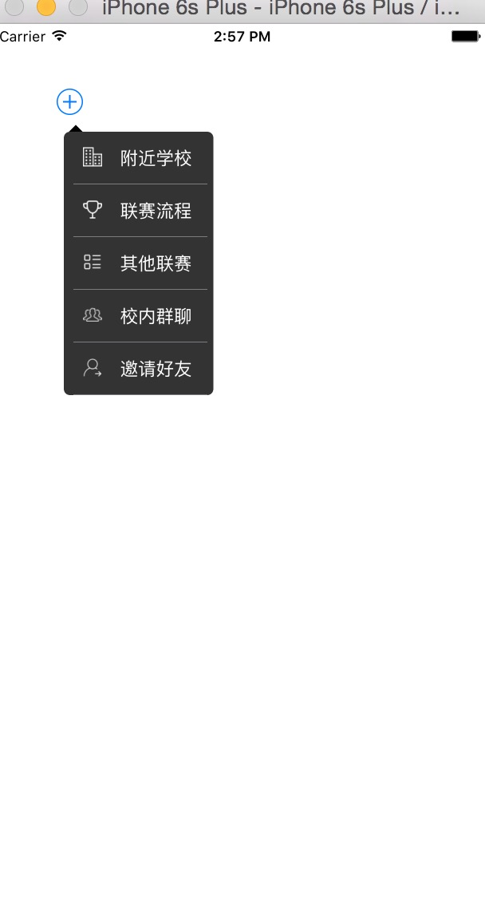

# MenuView
##类似微信的黑色菜单控件
```
/**
 *  初始化方法
 *
 *  @param titleArray 每个title
 *  @param imageArray 每个title对应的imageName
 *  @param origin     菜单的起始点
 *  @param width      菜单的宽度
 *  @param rowHeight  每个item的高度
 *  @param direct     TriangleDirection三角位置kLeftTriangle左，kRightTriangle右
 */

- (id)initWithTitleArray:(NSArray*)titleArray imageArray:(NSArray*)imageArray origin:(CGPoint)origin width:(CGFloat)width rowHeight:(CGFloat)rowHeight Direct:(TriangleDirection)triDirect;


/**
 *  隐藏
 *
 *  @param completion 隐藏后block
 */
- (void)dismissMenuView:(dismissCompletion)completion;
<<<<<<< Updated upstream


=======

>>>>>>> Stashed changes
